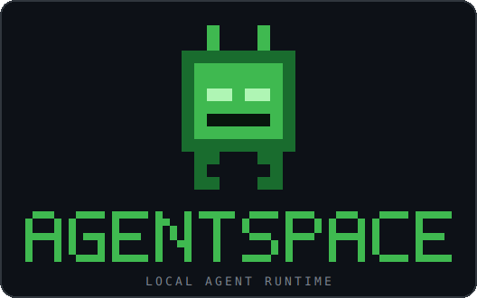

<p align="center">
  
</p>

<p align="center">
  <b>An agent OS you run from a shell.</b><br>
  Agents run locally on your Mac, write their own tools and their own agents —<br>
  and take commands from your phone. <b>No framework. No SDK. Just the loop.</b>
</p>

<p align="center">
  
  <br><sub><i>One goal writes a tool and arms a watch · a text from your phone drives the whole thing · an agent builds itself, live.</i></sub>
</p>

---

## Why

Most agent demos hide the loop behind an SDK. Here **the loop *is* the project** — a
hand-written read-call-run-repeat against the raw Messages API, short enough to read in
one sitting. Talk to it in plain English; a **conductor** routes the work across agents.
When an agent is missing a capability it **writes the tool and keeps going**. Ask for a
new kind of agent and it **writes that too** — live, no restart. Then text it from your
phone and watch the same thing happen from a café.

It started as a learning project. It got out of hand. That's the point.

## ✨ What it does

- 🛠️ **Writes its own tools.** An agent missing a capability calls `write_tool`;
  [PI](https://github.com/badlogic/pi-mono) authors the module into the registry, it
  hot-reloads, and the agent calls its brand-new tool *on the next turn*. `doc-writer`
  ships with **no** document tool — and builds one on demand.
- 🤖 **Writes its own agents.** `/create-agent "a stock portfolio tracker"` (or just ask)
  and PI scaffolds a whole new `agent.yaml` — prompt, tools, skills. Discovered instantly.
  No restart.
- 🗣️ **Just talk to it.** Type a goal in plain English; the **conductor** discovers the
  right agents, delegates, chains them, and synthesizes the answer — streaming each step.
- 📲 **Lives on your phone — both ways.** Agents push alerts to **Telegram** (or desktop /
  Slack), and you **text the bot back** to drive the conductor remotely. Locked to your
  own chat id.
- ⏰ **Schedules & watches.** *"check stock quotes every hour today"* spins up timed runs;
  *"tell me if BTC breaks $70k"* arms a **watchdog** that stays silent until it trips.
  Jobs survive restarts.
- 🔌 **MCP + native tools.** Any [Model Context Protocol](https://modelcontextprotocol.io)
  server (filesystem, fetch, git, github, …) wired per agent in `mcp/servers.yaml`, plus
  native tools: web & image search, full-page `web_fetch`, sports data, `python`, file
  I/O, conversation recall, scheduling, notifications.
- ☁️ **One command to the cloud.** `/deploy <agent>` hosts it on
  [Render](https://render.com) (token-protected) from the shell — then `/send` it like any
  local one. See [docs/DEPLOY.md](docs/DEPLOY.md).
- 🧩 **Hackable & visible.** No agent SDK. Declarative agents (`agent.yaml`), markdown
  skills, on-disk sessions, one OS process per agent, async runs with a live status feed.

## 🎬 Try it

Type these straight into the `agentspace>` prompt:

```text
# orchestration — conductor picks researcher → doc-writer on its own
research france's odds of winning the world cup and make a cool powerpoint about it

# self-writing agent — PI builds it, then you use it
/create-agent a stock portfolio tracking agent
/start stock-portfolio-tracker
/send stock-portfolio-tracker "how would $5k split across NVDA, AAPL, MSFT be doing?"

# self-writing tool — doc-writer has no document tool, so it authors one
/send doc-writer "create a markdown doc 'treehouse.md' with sections Overview, Materials, Steps"

# plain research with citations
what's the latest stable python release? cite a source

# schedule a recurring run, bounded to today — the scheduler agent sets it up
fetch cnn.com every hour today and summarize the top headlines

# watch a condition and only get pinged when it trips (to your phone, if Telegram is on)
watch AAPL and tell me if it drops below $180, check every 30 minutes

# let the conductor figure out it needs a new kind of agent entirely
I want to track my reading list — set that up and add "Dune"
```

> Commands start with `/` (try `/list` to see everything you've got). Anything **without**
> a slash is a natural-language goal handed to the conductor.

> 🧑‍🍳 **Not sure where to start?** [docs/RECIPES.md](docs/RECIPES.md) bundles the 17 agents
> into a handful of curated starting points (research desk, code workbench, watch & notify, …)
> — each with the one prerequisite to flip on and a goal to paste.

## 📲 …from your phone

Wire up a Telegram bot once (`/setup`, ~2 min) and the same bot **pushes alerts to you**
*and* **takes commands from you**. Be three timezones from your desk and text:

```text
track BTC and ping me if it cracks $70k          → arms a watch; alert lands on your phone
what are france's world cup odds?                → conductor → researcher → answer texted back
fetch the top HN headlines and summarize them    → runs the orchestration remotely
how's $5k across NVDA, AAPL, MSFT doing?          → portfolio agent replies in the thread
```

Same conductor, same agents, same thread — replies come straight back. Nobody but your
chat id can drive it.

---

## Quick start

```bash
export ANTHROPIC_API_KEY=sk-ant-...                 # agents call the Messages API
uv sync                                              # install python deps
npm install -g @mariozechner/pi-coding-agent         # optional: enables write_tool

uv run agentspace                                    # launch the host shell
uv run agentspace-monitor                            # (optional, 2nd terminal) live feed
```

> 📲 **Optional — phone alerts & remote control.** On first launch (or `/setup`) you can
> wire up a Telegram bot in ~2 minutes: paste a [@BotFather](https://t.me/botfather) token,
> message the bot once, and AgentSpace auto-detects your chat id. After that, agents can
> push alerts to your phone and you can text the bot to drive the conductor.

```text
# just say what you want — the conductor discovers and orchestrates the agents:
agentspace> research france's odds of winning the world cup and make a cool powerpoint about it

# …or drive agents directly with /commands:
agentspace> /list
agentspace> /start researcher
agentspace> /send researcher "what's the latest stable python? cite a source"
agentspace> /ps
agentspace> /quit
```

> No API key? The host still runs and you can start/stop agents — the conductor and `send` just return a clear error.

---

## How it works

```text
  HOST (REPL shell)  ──start/stop──▶  agent: researcher   (process · http :7001)
        │                            agent: doc-writer    (process · http :7002)
        └── send ──http POST──────────────▲  each runs its own raw Messages-API loop
```

**The conductor (natural language).** Type a goal in plain English and the host's
conductor (`agentspace/host/orchestrator.py`) plans it: it discovers the registered
agents (`list_agents`), delegates sub-tasks to the best-suited ones (`run_agent`,
auto-starting them), chains their outputs, and synthesizes a final answer — streaming
each step as it goes. For *"research France's WC odds and make a deck"* it routes
`researcher` → `doc-writer` on its own. Explicit commands (`start`, `send`, `ps`, …)
still work for driving agents directly.

**Host (control plane).** Apart from the conductor, the shell launches one OS process
per agent, stops them, and relays messages over HTTP. Agents run in parallel and show
up in `ps`.

**Agent (one process each).** Every agent is a small HTTP server wrapping a
**hand-written tool loop** (`agentspace/agent/loop.py`) against the raw Anthropic
Messages API:

```text
load history → call the model → if it wants a tool, run it and feed the result back → repeat → save
```

That loop is the whole point — nothing is hidden behind an SDK.

**Tools** come in three flavors, all landing in the same `(tools, handlers)` the loop dispatches:
- **client tools** — run locally by the host (the full set is in [🧰 Tools](#-tools) below).
- `web_search` — a **server tool** Anthropic runs; we never touch it.
- **MCP tools** — pulled from [Model Context Protocol](https://modelcontextprotocol.io)
  servers an agent connects to (`mcp__<server>__<tool>`). See [docs/MCP.md](docs/MCP.md).

**Skills** (`skills/<name>/SKILL.md`) are markdown playbooks with progressive
disclosure: the prompt only lists a skill's name + description until the agent calls
`load_skill` to pull in the full instructions.

**Sessions** are conversation history persisted to disk, so an agent remembers across
messages (`send … --session <id>`).

**Async runs + live status.** `send` returns immediately with a run id; a background
monitor streams each step (`🔧 web_search…`, `· thinking…`) and prints the reply when
it's done. Fire several agents and watch them interleave. Long-running tools stream
interim progress too — `write_tool` reports each of PI's steps (`✎ pi: writing
create_document.py …`) instead of going dark for minutes.

**Per-agent dashboard.** Run `agentspace-monitor` in a second terminal: each running agent
gets its **own boxed pane** that streams only its output — so multiple agents never
interleave. Read-only; great for watching an orchestration unfold while the main shell
stays your clean input area. (Prefer one window? `/stream off` silences the inline event
feed in the REPL and you watch the dashboard instead.)

**Schedule, watch & notify.** Scheduling is itself an agent capability, not bolted-on
plumbing. Say *"check stock quotes every hour today"* and the conductor routes it to the
**scheduler** agent, which parses the timing and registers a job. A thin host **ticker**
(`agentspace/host/scheduler.py` — the one piece that must live host-side, since an agent
can't watch a clock) fires each due job's goal back **through the conductor**, so it
re-routes to whatever agent fits. Pair it with the **watchdog** agent — it checks a
condition against live data and calls `send_notification` *only when it trips*, staying
quiet otherwise. Notifications go to a macOS desktop popup, Slack, a durable log, and —
the good part — your **phone via Telegram**. Jobs persist to `runtime/scheduler/jobs.json`
and survive restarts.

**Telegram, two ways.** Set it up once in `/setup` (or `/settings telegram`) and the same
bot both **pushes alerts to you** and **takes commands from you**: a host bridge
(`agentspace/host/telegram_bridge.py`) long-polls Telegram, hands each message you send to
the conductor, and texts the reply back — locked to your own chat id so nobody else can
drive it. Be away from your desk, text *"watch BTC and ping me if it breaks $70k"*, and get
the alert on the same thread.

**Self-extending (the fun part).** The system can grow itself, at two levels, both via
the [PI](https://github.com/badlogic/pi-mono) coding agent:
- **New tools** — give an agent `write_tool` and it authors the tool it's missing: PI
  writes a module into `agentspace/agent/tools/generated/`, the registry hot-reloads, and
  the agent calls its brand-new tool on the next turn. That's how `doc-writer` ships with
  **no** document tool yet creates one on demand.
- **New agents** — `create-agent <description>` (or just ask the conductor) has PI write a
  whole `agents/<slug>/agent.yaml` from your description, wiring up its prompt, tools, and
  skills. The registry discovers it instantly — no restart. e.g. *"a stock portfolio
  tracking agent"* → a ready-to-run agent that can even author its own quote-fetching tool.

---

## 🧰 Tools

Every agent gets the tools its `agent.yaml` lists. Three flavors, one dispatch path.

**Native (client) tools** — run locally by the host:

| tool | what it does |
|---|---|
| `sh` | run a shell command on the host machine |
| `python` | run a Python 3 snippet, return stdout+stderr |
| `read_file` / `write_file` | read / write a UTF-8 text file |
| `http_fetch` | HTTP GET a URL, return the raw body |
| `web_fetch` | fetch a page as full readable text (markup stripped) |
| `image_search` | search the web for images (inline markdown thumbnails) |
| `fetch_sports_data` | live scores, status & schedules for major leagues (incl. the FIFA World Cup) |
| `conversation_search` | search past session transcripts (memory) by keyword |
| `recent_chats` | list recent sessions, newest-first |
| `schedule_create` / `schedule_list` / `schedule_cancel` | timed & recurring runs (the scheduler agent's tools) |
| `send_notification` | short alert → desktop popup, Slack, and/or **Telegram** (your phone) |
| `send_file` | deliver a produced file to you via Telegram (as a download) |
| `load_skill` | pull in a skill's full instructions on demand |
| `write_tool` | **author a brand-new tool for itself** via [PI](https://github.com/badlogic/pi-mono) (needs `can_author_tools`) |

**Server tool** — `web_search`: Anthropic runs it and returns results inline.

**MCP tools** — any [MCP](https://modelcontextprotocol.io) server's tools, declared in
`mcp/servers.yaml` and wired per agent (`mcp__<server>__<tool>`): e.g. `filesystem`, `fetch`,
`git`, `github`. See [docs/MCP.md](docs/MCP.md).

> 🛠️ Tools an agent writes for itself with `write_tool` land in
> `agentspace/agent/tools/generated/` and become callable on the very next turn — no restart.

## Models

Which model each part of the system runs on, and how to change it:

| Component | Model (default) | How to change |
|---|---|---|
| **Agents** (researcher, coder, scheduler, watchdog, …) | `claude-sonnet-4-6` | `model:` in that agent's `agents/<name>/agent.yaml` |
| **Conductor** (the orchestrator) | `claude-sonnet-4-6` | `AGENTSPACE_CONDUCTOR_MODEL` env var |
| **PI** (`write_tool` / `create-agent` authoring) | Anthropic, PI's default Claude | `AGENTSPACE_PI_MODEL` + `AGENTSPACE_PI_PROVIDER` env vars |
| **`web_search`** | runs server-side on the calling agent's model | — (set the agent's `model:`) |
| **MCP servers** | none — they're tool providers, not models | — |

Every agent currently ships on `claude-sonnet-4-6` (the `AgentSpec` default). Per-agent
overrides let you, say, put a heavy `coder` on Opus and a quick `assistant` on Haiku:

```yaml
# agents/coder/agent.yaml
model: claude-opus-4-8
```

```bash
# run the conductor and PI on specific models
export AGENTSPACE_CONDUCTOR_MODEL=claude-opus-4-8
export AGENTSPACE_PI_MODEL=claude-sonnet-4-6
```

`/ps` shows each agent's current model; the reply footer reports token usage **and an
estimated $ cost** per run (conductor goals show a combined total). Rates live in
`agentspace/common/pricing.py` — they're estimates; tweak to match your plan.
The prompt keeps a **persistent history** (`runtime/history`): press ↑ to recall past
commands and goals across sessions, and accept the greyed autosuggestion with →.
On first launch a quick **setup** flow walks you through the API key, a default model, and
optional prerequisites — re-run it anytime with `/setup`, or tweak models live with
`/settings` (e.g. `/settings model coder opus`, `/settings conductor haiku`).

## Shell commands

Commands start with `/`. Anything without a slash is a natural-language goal for the conductor.

| command | what it does |
|---|---|
| *(plain English)* | hand a goal to the conductor — it picks & orchestrates agents |
| `/list` | plain-English overview of every agent, tool & skill you have |
| `/settings [...]` | show/change models live (agents, conductor, PI), API key, **Telegram** |
| `/setup` | re-run the first-time setup flow (API key, model, Telegram) |
| `/mcp` | list MCP servers and live connection status |
| `/deploy <agent>` / `/undeploy` / `/deploys` | host an agent on Render (cloud) & manage it |
| `/agents` | list agents and what each is for |
| `/create-agent <description>` | have PI build a new agent and add it to the registry |
| `/clean [output\|tools\|sessions\|all]` | move agent-produced files to trash (default: `output/`) |
| `/trash [list\|restore [batch]\|empty]` | inspect / undo / purge what `/clean` set aside |
| `/ps` / `/ls` | agent status table (running/stopped, port, pid) |
| `/start` / `/stop` / `/restart <name>` | manage agent processes |
| `/send <name> "<msg>" [--session <id>] [--wait]` | send a message (async; `--wait` blocks) |
| `/status` / `/runs <name>` | in-flight runs / run history |
| `/stream [on\|off]` | toggle the inline event feed (off = clean REPL; use the monitor) |
| `/gc` | sweep orphan agent processes left by a previous host session (also runs at startup) |
| `/schedule [list\|cancel <id>\|...]` | timed/recurring runs (or just say *"check X every hour today"*) |
| `/logs <name> [n]` | tail an agent's log |
| `/sessions <name>` / `/session <name> <id>` | list / inspect sessions |
| `/help` / `/quit` | help / exit |

## Add an agent

Drop a folder under `agents/` — no code change needed:

```yaml
# agents/my-agent/agent.yaml
name: my-agent
model: claude-sonnet-4-6
system_prompt: |
  You are a helpful agent.
tools: [sh, load_skill]      # web_search, web_fetch, image_search, fetch_sports_data, sh, read_file,
                             # write_file, http_fetch, python, conversation_search, recent_chats,
                             # schedule_create/list/cancel, send_notification, write_tool, load_skill
skills: [summarize]
mcp_servers: [filesystem]    # optional: MCP servers from mcp/servers.yaml
can_author_tools: false      # true to allow write_tool (PI)
```

## Layout

```text
agentspace/host/      host REPL, supervisor, registry, scheduler ticker, telegram bridge  (control plane)
agentspace/agent/     loop, server, sessions, tools, pi_bridge, mcp_client  (one per process)
agentspace/common/    shared bits: paths, pricing, schedule store + NL time parser
agents/               declarative agent registry (agent.yaml each)
skills/               markdown skills
mcp/servers.yaml      MCP server catalog (filesystem, fetch, git, github)
Dockerfile, render.yaml   cloud-deploy image + Render blueprint
docs/                 TOOL_CONTRACT, AGENT_CONTRACT, MCP, DEPLOY
```

## Safety

`sh`, `python`, `write_file`, and `write_tool` run real commands / write & execute code on
your machine (inside the agent's working dir, logged), and MCP servers run as local
subprocesses. Great for a local sandbox; don't point these agents at untrusted input.

The Telegram bridge is **locked to your own chat id** (others who find the bot are ignored),
and credentials (bot token, chat id) live in `runtime/settings.json`, which is gitignored —
keep it that way.

## License

[MIT](LICENSE) © 2026 Olivier Meirhaeghe
